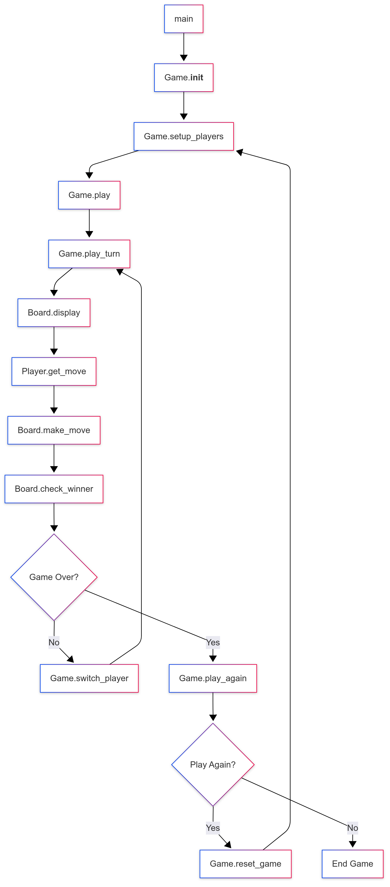

# Tic-Tac-Toe Game

A complete implementation of the classic Tic-Tac-Toe game using Object-Oriented Programming principles.

## Project Structure

```
tic-tac-toe/
├── main.py          # Main entry point
├── game.py          # Game class - manages game flow
├── board.py         # Board class - handles 3x3 grid
├── player.py        # Player class - manages player data
└── README.md        # This file
```

## Features

- **Clean OOP Design**: Separate classes for Board, Player, and Game
- **Input Validation**: Handles invalid moves and positions
- **User-Friendly Interface**: Clear board display and instructions
- **Multiple Rounds**: Play again functionality
- **Error Handling**: Graceful handling of user interruptions

## How to Play

1. Run the game: `python main.py`
2. Enter player names when prompted
3. Players take turns entering moves in format (row, col) with numbers 1-3
4. First player to get 3 in a row (horizontal, vertical, or diagonal) wins
5. Choose to play again or exit

## Classes Overview

### Board Class
- Manages the 3x3 grid
- Validates moves
- Checks for winners and draws
- Displays the current state

### Player Class
- Stores player name and symbol
- Handles move input with validation
- Converts user input to board coordinates

### Game Class
- Manages overall game flow
- Handles player turns
- Coordinates between Board and Player classes
- Manages game state and rounds

## Running the Game

```bash
cd Week10/tic-tac-toe
python main.py
```

## Code Quality

The code follows Python style guidelines and is ready for Pylint analysis. All classes have proper docstrings and follow encapsulation principles.

## Diagram


